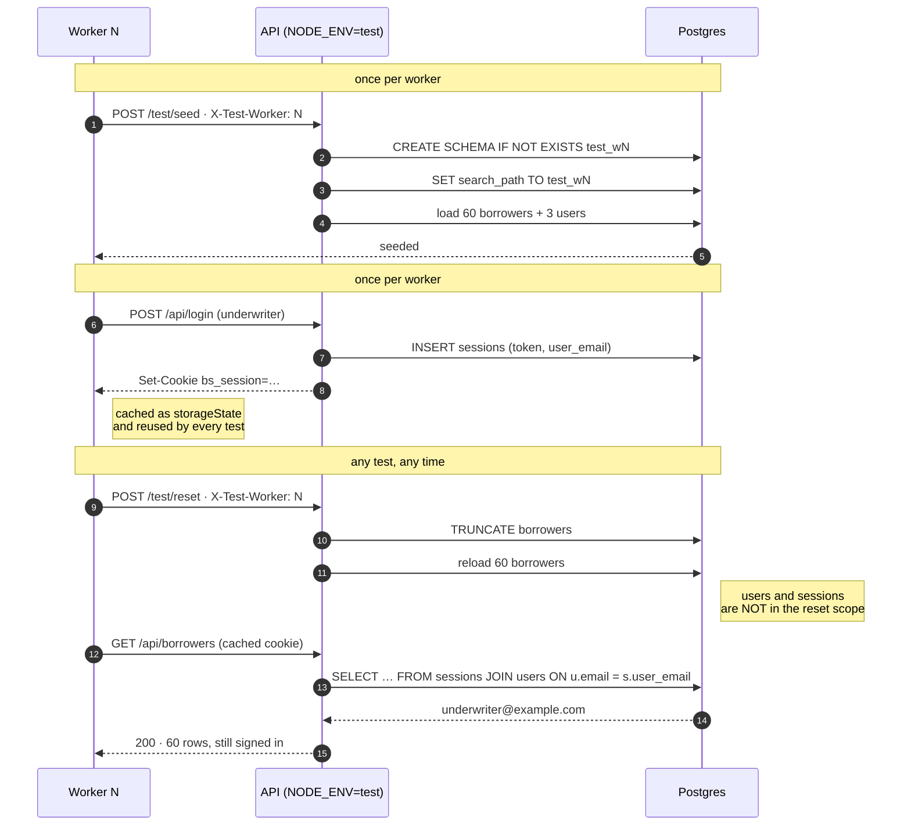
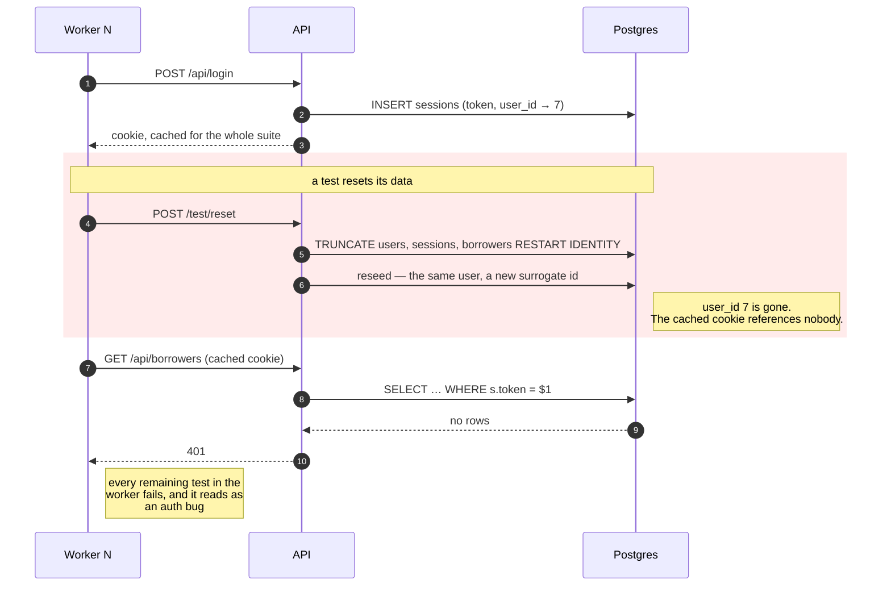

# Worker isolation, and the trap inside it

Each Playwright worker owns a Postgres schema. It seeds it once, caches a login, and resets
its data whenever a test needs a clean slate — without touching any other worker.

That sounds like two independent mechanisms. It isn't, and the way they interact is the
whole reason this document exists.

## The lifecycle that works



## The trap

Both mechanisms are individually reasonable. Composed naively they destroy each other.



**The data reset silently invalidated the auth it was supposed to be independent of.**

What makes this expensive to diagnose is the shape of the failure. It is not the reset that
fails — the reset succeeds, reports 60 rows, and looks perfect. The *next* test fails, and
the one after that, with a 401 that points at the login code. At one worker it may never
appear at all, because nothing resets mid-suite. At four it appears intermittently,
depending on which worker happened to run the resetting spec.

## The fix, both halves

Either half alone leaves the trap open:

| | Without it | With it |
|---|---|---|
| **Sessions key on a natural key** (`user_email`, not a `SERIAL` id) | A reseeded user is a *different* user, so a surviving session resolves to nobody | A reseeded user is the *same* user |
| **Reset scope excludes `users` and `sessions`** | The session row is deleted outright, and the key it used is irrelevant | The session is still there to resolve |

The first version of this implementation had only the natural key. The proof spec caught it
in one run — every request after the reset 401'd. Stated plainly, *"resetting test data
should not log everybody out"* is obvious. It is much less obvious when the symptom is
"the third test in the file fails, but only at two workers".

There is a third option worth naming, because it is what most teams reach for: **store
sessions outside the reset scope entirely** — Redis, a signed stateless cookie, a separate
schema. That works, and it trades a database table for another moving part. Keeping
sessions in the same schema and narrowing the reset instead keeps the whole lifecycle in
one place, which for a sandbox whose job is to *teach* this failure is the point.

## Why `search_path` needs the same care

Isolation has a second failure mode that produces the same kind of unreproducible flake.

A pooled connection remembers its `search_path`. Release a client with `test_w3` still set
and the next borrower of that client silently reads worker 3's data — a cross-worker leak
that depends on which connection the pool happened to hand out.

`server/db/pool.js` sets the path on **every** checkout, before any statement, and does not
export the pool. The invariant is "no query without an explicit schema", and it is enforced
by making any other path impossible rather than by asking people to remember.

## Running the proof

```bash
npx playwright test tests/isolation --workers=4
```

Five tests across four workers: one signs in, mutates data, resets mid-test and asserts its
session survived; four wipe their own schema concurrently and assert nobody saw anybody
else's rows. If the schemas ever leaked, or the reset scope ever grew, these interfere and
flake — which is the signal wanted.
